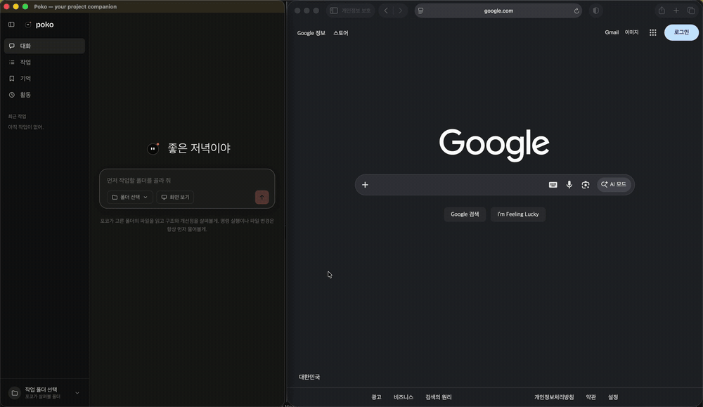
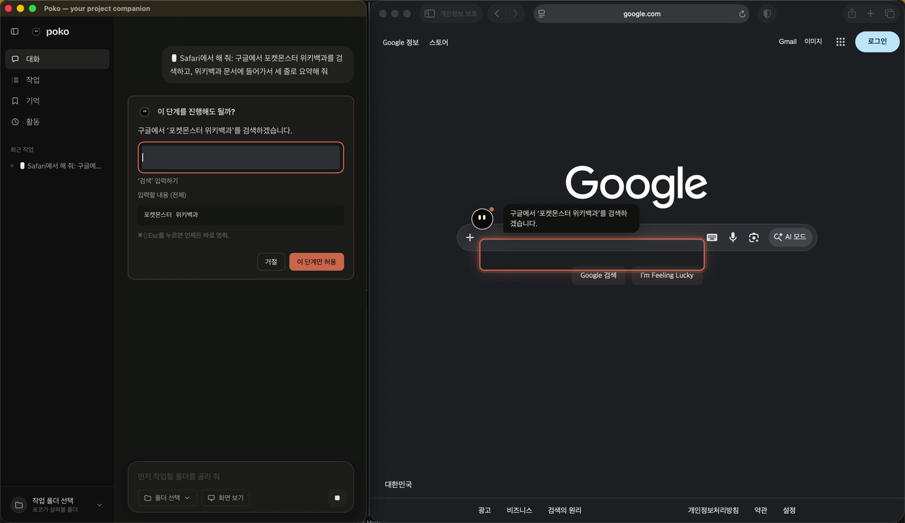

# Poko

**A friendly local AI desktop agent for getting real work done in your projects.**

Poko is an early-stage open-source project. It gives local coding-agent tools a friendly character-led desktop interface and keeps conversation history, tasks, and explicit memories on your computer. It can also look at a browser window you pick and do a task in it, one step at a time, asking you before each step.



*Poko in "대신 해 줘" mode. Request: "구글에서 포켓몬스터 위키백과를 검색하고, 위키백과 문서에 들어가서 세 줄로 요약해 줘" (search Google for the Pokémon article on Wikipedia, open it, and summarize it in three lines). Poko points at each target on screen, waits for approval on the card, and returns a summary. The recording is sped up 1.5× and uses a private Safari window. Thumbnails of other windows in the picker are blurred.*


## Screenshots

| Tasks | Memory |
| --- | --- |
|  |  |

**Screen step approval**



**Activity**


Screenshots use sample data.

## Project status

- [x] Foundation and architecture documented
- [x] Character and chat desktop app (Phase 01)
- [x] Read-only Codex project analysis (Phase 02)
- [x] Local task, conversation, activity, workspace, and memory persistence (Phase 03)
- [x] In-app approval gate for Codex command and file-change requests (Phase 04)
- [x] Saved memories and recent conversation as context, Markdown answers, and streaming replies (Phase 05)
- [x] Screen companion: Poko looks at a window you pick and acts in it one approved step at a time, on screen (Phase 06, macOS)
- [x] Multiple conversations: new, switch, rename, and delete, each with its own context (Phase 07)
- [ ] Approval-gated file writes in a workspace-write sandbox (later)

## What Poko is aiming for

Talk to a small desktop character in plain language, in as many separate conversations as you like. Poko sends read-only project-analysis requests to the locally installed Codex CLI, shows understandable progress, and reports the result. Conversation, tasks, Activity, workspace selection, and user-managed memories persist locally in SQLite.

## Screen companion (macOS)

Open **화면 보기** under the composer, write what you want in the request field, and pick a window.

- **보고 설명해 줘 (look):** Poko captures the window, answers your question about it, and then flies out onto your screen to point at the controls it mentioned.
- **대신 해 줘 (do it for me):** in a browser window, Poko works toward your goal one step at a time:
  1. It looks at the page and proposes one step, a click or typed text.
  2. Its on-screen character points at the target, and the card in Poko's window shows a crop of that target and, for typing, the full text.
  3. The step runs only after you press **이 단계만 허용**.
  4. Poko looks again and proposes the next step. When the goal asks for information, such as "open the email and summarize it", Poko returns the answer at the end.

Examples: "검색창에 오늘 날씨를 검색해 줘", "구글에서 OO 공식 사이트를 찾아 들어가서 채용 메뉴 내용을 요약해 줘", "받은편지함에서 9월 30일 OO에게 온 메일을 열어서 요약해 줘".

It needs macOS **Screen Recording** and **Accessibility** permissions. Poko explains both and opens the right settings pane. Before the first use, it also explains what is sent: one window's screenshot and element names go to Codex (OpenAI), and Poko deletes the screenshot when the task ends.

Safety:
- Poko acts only inside `http(s)` web pages in Safari, Chrome, Arc, Firefox, or Edge. Other apps, browser toolbars, and settings pages are look-only.
- Before each step, Poko finds the target again and checks several things. It must still be the same element. It must not be covered by another window or a pop-up. Nothing inside it may take the click instead, such as a star, a checkbox, or a button that appears on hover. Links that aren't web pages, or that point to installers or archives, are refused. Password fields are never typed into.
- Clicks are real mouse clicks at a checked point. The cursor returns to where it was. Typing sets the field's value; Poko never sends keystrokes.
- **⌘⇧Esc** stops a task at once, and nothing acts after a stop. **거절** ends the task.
- Text on the page is treated as untrusted data, never as instructions. Codex runs with no shell and no file access for screen tasks.

Details and test results are in [Phase 06](docs/phases/phase-06.md).

## Development

Requirements: Node.js 24+ and pnpm 10+. Codex CLI must be installed and authenticated for project analysis. The screen companion needs macOS with Xcode command line tools (`swiftc`); `pnpm dev` and `pnpm build` compile the small `poko-ax` accessibility helper first.

```sh
pnpm install
pnpm dev
```

Useful checks (the same ones run on every pull request in GitHub Actions, on macOS):

```sh
pnpm typecheck
pnpm lint
pnpm test
pnpm build
```

Poko analyzes a selected workspace through the locally installed Codex CLI with a restricted read-only permission profile. It stores app data in its Electron user-data directory and does not upload memories or history to a Poko service. Agent requests are sent to the provider you configure through Codex CLI. Read [the architecture](docs/architecture.md), [the Phase 02 implementation](docs/phases/phase-02.md), [the Phase 03 design](docs/phases/phase-03.md), and [the Phase 04 approval gate](docs/phases/phase-04.md) for the current boundaries and tradeoffs.

## Security direction

Poko keeps tool execution and SQLite out of the UI renderer. Codex runs through its App Server in a read-only sandbox. When Codex asks to run a command or change files, Poko shows the concrete action and lets you approve it once or decline. Requests whose working directory or file paths leave the workspace, that ask for network access, or that would widen permissions are declined automatically. In v0.1 Poko is effectively read-only. It never approves shell commands, because an approved command would run outside the sandbox, and these requests are declined automatically. File-change approvals are supported: Poko shows the diff, keeps paths inside the selected folder and outside `.git`, and an approval covers only that one change. In practice, Codex in the read-only sandbox doesn't ask to change files, so Poko doesn't edit your project yet. A broader write mode, where Poko edits files as part of a task, stays off until it has been verified on each supported OS. SQLite content is local and unencrypted in v0.1; credentials are not stored in the database. With each request, Poko also sends your saved memories and the last few completed exchanges of the conversation to Codex, so it can follow up and respect your preferences. Nothing else from the database is sent.

## Contributing

Contributions and feedback are welcome. Please open an issue to discuss larger changes before starting implementation. Each milestone is developed through a pull request with review and verification.

## License

Poko is licensed under the MIT License. See [LICENSE](LICENSE).
