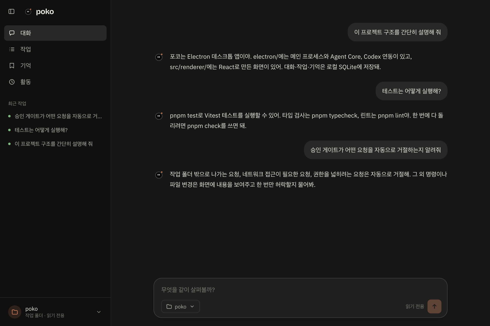
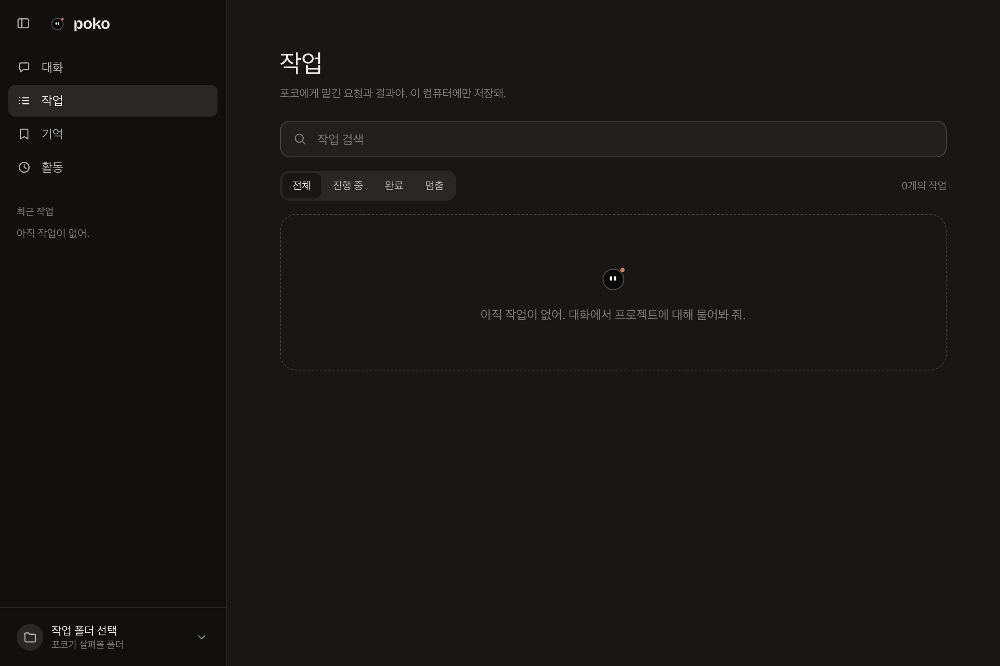
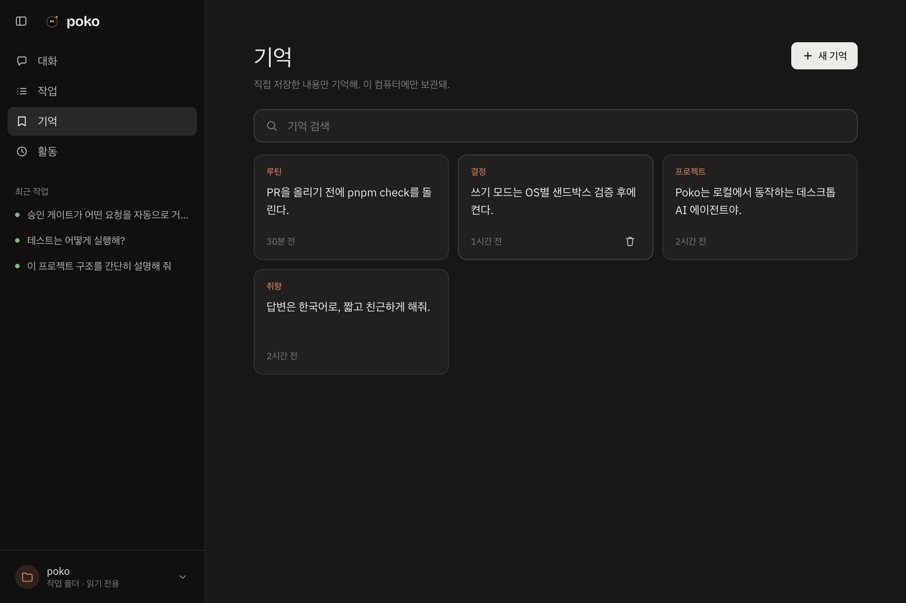
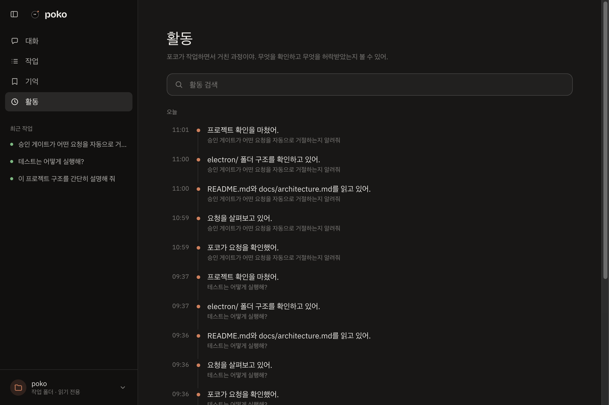

# Poko

**A friendly local AI desktop agent for getting real work done in your projects.**

Poko is an early-stage open-source project. It gives local coding-agent tools a friendly character-led desktop interface and keeps conversation history, tasks, and explicit memories on your computer.



## Screenshots

| Tasks | Memory |
| --- | --- |
|  |  |

**Activity**



Screenshots use sample data.

## Project status

- [x] Foundation and architecture documented
- [x] Character and chat desktop app (Phase 01)
- [x] Read-only Codex project analysis (Phase 02)
- [x] Local task, conversation, activity, workspace, and memory persistence (Phase 03)
- [x] In-app approval gate for Codex command and file-change requests (Phase 04)
- [x] Saved memories and recent conversation as context, Markdown answers, and streaming replies (Phase 05)
- [ ] Approval-gated write mode, after per-OS sandbox verification (Phase 06)
- [ ] Multiple conversations (Phase 07)

## What Poko is aiming for

Talk to a small desktop character in plain language. Poko sends read-only project-analysis requests to the locally installed Codex CLI, shows understandable progress, and reports the result. Conversation, tasks, Activity, workspace selection, and user-managed memories persist locally in SQLite.

## Development

Requirements: Node.js 24+ and pnpm 10+. Codex CLI must be installed and authenticated for project analysis.

```sh
pnpm install
pnpm dev
```

Useful checks:

```sh
pnpm typecheck
pnpm lint
pnpm test
pnpm build
```

Poko analyzes a selected workspace through the locally installed Codex CLI with a restricted read-only permission profile. It stores app data in its Electron user-data directory and does not upload memories or history to a Poko service. Agent requests are sent to the provider you configure through Codex CLI. Read [the architecture](docs/architecture.md), [the Phase 02 implementation](docs/phases/phase-02.md), [the Phase 03 design](docs/phases/phase-03.md), and [the Phase 04 approval gate](docs/phases/phase-04.md) for the current boundaries and tradeoffs.

## Security direction

Poko keeps tool execution and SQLite out of the UI renderer. Codex runs through its App Server in a read-only sandbox. When Codex asks to run a command or change files, Poko shows the concrete action and lets you approve it once or decline. Requests that leave the workspace, need network access, or would widen permissions are declined automatically. Write mode stays off until the sandbox's pause-before-action behavior is verified on each supported OS. SQLite content is local and unencrypted in v0.1; credentials are not stored in the database. With each request, Poko also sends your saved memories and the last few completed exchanges of the conversation to Codex, so it can follow up and respect your preferences. Nothing else from the database is sent.

## Contributing

Contributions and feedback are welcome. Please open an issue to discuss larger changes before starting implementation. Each milestone is developed through a pull request with review and verification.

## License

Poko is licensed under the MIT License. See [LICENSE](LICENSE).
